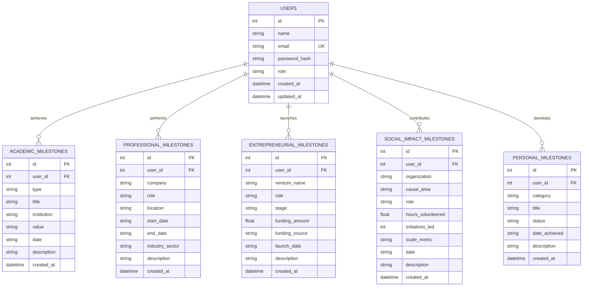
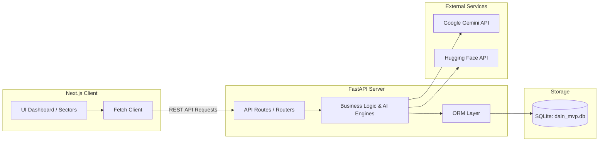

# DAIN Platform Architecture Context

This document outlines the architecture plan, folder layout, database schema, and integration strategy for the DAIN Ecosystem Platform. The platform tracks student and professional growth across five core developmental sectors.

> [!NOTE]
> This project is designed as a lightweight full-stack application using a Next.js App Router frontend, a FastAPI backend, and an SQLite database.

---

## 1. Project Directory Structure

The workspace is structured to separate frontend, backend, database, and configuration files.

### Current Directory Layout
```
d:\dain_demo\
├── .agent/                      # AI assistant skills & resources
├── .env                         # Workspace credentials (GOOGLE_API_KEY, HF_TOKEN)
├── dain_mvp.db                  # SQLite Database (Initialized)
├── Launch_DAIN_Dev.bat          # Sandbox environment initialization script
└── test_hf.py                   # Hugging Face integration verification script
```

### Target Directory Layout (Proposed)
```
d:\dain_demo\
├── backend/                     # FastAPI Backend Application
│   ├── app/
│   │   ├── core/                # Config, security, DB connections
│   │   ├── models/              # SQLAlchemy database models
│   │   ├── routers/             # API route handlers (endpoints)
│   │   ├── schemas/             # Pydantic schemas for request/response validation
│   │   ├── services/            # Core business logic and AI integration
│   │   └── main.py              # Application entry point
│   ├── requirements.txt         # Python dependencies
│   └── alembic.ini              # DB migrations configuration (optional)
│
├── frontend/                    # Next.js App Router Frontend
│   ├── app/                     # App Router directory (pages, layouts)
│   │   ├── layout.tsx           # Global layout with styling providers
│   │   ├── page.tsx             # Dashboard/Landing page
│   │   ├── academic/            # Academic sector pages
│   │   ├── professional/        # Professional sector pages
│   │   ├── entrepreneurial/     # Entrepreneurial sector pages
│   │   ├── social-impact/       # Social impact sector pages
│   │   └── personal/            # Personal milestone pages
│   ├── components/              # Shared UI components (UI cards, forms, charts)
│   ├── lib/                     # API client utilities and helpers
│   ├── package.json             # NPM dependencies
│   └── tailwind.config.ts       # Tailwind CSS configuration (if requested)
│
├── dain_mvp.db                  # SQLite Database File (Root-level)
└── project-context.md           # Architecture and Context Document
```

---

## 2. Core Sectors Data Mapping

The platform tracks and analyzes user growth across five core sectors, each containing specific entity fields stored in [dain_mvp.db](file:///d:/dain_demo/dain_mvp.db):

| Sector | Core Entities & Milestones | Key Database Fields |
| :--- | :--- | :--- |
| **Academic** | Publications, research, CGPA milestones | `type` (publication/research/cgpa), `title`, `institution`, `value` (e.g., GPA or journal), `date`, `description` |
| **Professional** | Corporate roles, industry placements | `company`, `role`, `location`, `start_date`, `end_date`, `industry_sector`, `description` |
| **Entrepreneurial** | Startups, ventures, funding milestones | `venture_name`, `role`, `stage` (ideation/mvp/funding/scaling/exited), `funding_amount`, `funding_source`, `launch_date` |
| **Social Impact** | Volunteering, community scaling, initiatives | `organization`, `cause_area`, `role`, `hours_volunteered`, `initiatives_led`, `scale_metric` (e.g., reach) |
| **Personal** | Extracurricular milestones, skill achievements | `category` (extracurricular/skill), `title`, `status` (in_progress/achieved), `date_achieved`, `description` |

---

## 3. Database Schema

The SQLite database [dain_mvp.db](file:///d:/dain_demo/dain_mvp.db) is initialized with the following table structure:



### Table Definitions

#### `users`
*   `id`: `INTEGER PRIMARY KEY AUTOINCREMENT`
*   `name`: `TEXT NOT NULL`
*   `email`: `TEXT UNIQUE NOT NULL`
*   `password_hash`: `TEXT`
*   `role`: `TEXT DEFAULT 'user'`
*   `created_at`: `DATETIME DEFAULT CURRENT_TIMESTAMP`
*   `updated_at`: `DATETIME DEFAULT CURRENT_TIMESTAMP`

#### `academic_milestones`
*   `id`: `INTEGER PRIMARY KEY AUTOINCREMENT`
*   `user_id`: `INTEGER NOT NULL (FK -> users.id)`
*   `type`: `TEXT CHECK(type IN ('publication', 'research', 'cgpa', 'other')) NOT NULL`
*   `title`: `TEXT NOT NULL`
*   `institution`: `TEXT NOT NULL`
*   `value`: `TEXT` (e.g. "3.95 CGPA", "IEEE Conference")
*   `date`: `TEXT` (YYYY-MM-DD)
*   `description`: `TEXT`

#### `professional_milestones`
*   `id`: `INTEGER PRIMARY KEY AUTOINCREMENT`
*   `user_id`: `INTEGER NOT NULL (FK -> users.id)`
*   `company`: `TEXT NOT NULL`
*   `role`: `TEXT NOT NULL`
*   `location`: `TEXT`
*   `start_date`: `TEXT`
*   `end_date`: `TEXT`
*   `industry_sector`: `TEXT`
*   `description`: `TEXT`

#### `entrepreneurial_milestones`
*   `id`: `INTEGER PRIMARY KEY AUTOINCREMENT`
*   `user_id`: `INTEGER NOT NULL (FK -> users.id)`
*   `venture_name`: `TEXT NOT NULL`
*   `role`: `TEXT NOT NULL`
*   `stage`: `TEXT CHECK(stage IN ('ideation', 'mvp', 'funding', 'scaling', 'exited', 'other')) NOT NULL`
*   `funding_amount`: `REAL DEFAULT 0.0`
*   `funding_source`: `TEXT`
*   `launch_date`: `TEXT`
*   `description`: `TEXT`

#### `social_impact_milestones`
*   `id`: `INTEGER PRIMARY KEY AUTOINCREMENT`
*   `user_id`: `INTEGER NOT NULL (FK -> users.id)`
*   `organization`: `TEXT NOT NULL`
*   `cause_area`: `TEXT NOT NULL`
*   `role`: `TEXT NOT NULL`
*   `hours_volunteered`: `REAL DEFAULT 0.0`
*   `initiatives_led`: `INTEGER DEFAULT 0`
*   `scale_metric`: `TEXT` (e.g., "recommending to 100+ local communities")
*   `date`: `TEXT`
*   `description`: `TEXT`

#### `personal_milestones`
*   `id`: `INTEGER PRIMARY KEY AUTOINCREMENT`
*   `user_id`: `INTEGER NOT NULL (FK -> users.id)`
*   `category`: `TEXT CHECK(category IN ('extracurricular', 'skill', 'hobby', 'other')) NOT NULL`
*   `title`: `TEXT NOT NULL`
*   `status`: `TEXT CHECK(status IN ('in_progress', 'achieved')) DEFAULT 'achieved'`
*   `date_achieved`: `TEXT`
*   `description`: `TEXT`

---

## 4. Application Architecture Plan



### Backend Architecture Strategy
1.  **FastAPI Setup**: Async routers for `/api/users`, `/api/academic`, `/api/professional`, `/api/entrepreneurial`, `/api/social-impact`, `/api/personal`, and `/api/insights` (AI recommendations).
2.  **ORM (SQLAlchemy 2.0)**: Use async sessions for interacting with SQLite database.
3.  **Data Validation (Pydantic V2)**: High-performance input validation schemas.
4.  **AI Engine Integration**:
    *   **Google Gemini (`GOOGLE_API_KEY`)**: Summarize milestones, suggest professional or academic trajectories, analyze skills gap, and generate personalized growth plans.
    *   **Hugging Face (`HF_TOKEN`)**: Generate embeddings for achievements, matching similar ventures, profiles, or suggesting mentor matchings using semantic search.

### Frontend Architecture Strategy
1.  **Rendering Modes**: Use **React Server Components (RSC)** for initial page load and static/dynamic rendering. Use **Client Components** for forms, interactive charts, and real-time updates.
2.  **Visual Design**: A vibrant dark-mode-first aesthetic with a curated color scheme representing the five sectors:
    *   Academic: Sapphire Blue
    *   Professional: Emerald Green
    *   Entrepreneurial: Gold/Orange
    *   Social Impact: Amethyst Purple
    *   Personal: Crimson Rose

---

## 5. Verification & Setup Instructions

### Environment Verification
Make sure the `.env` file contains correct API keys:
*   `GOOGLE_API_KEY` - Used for Google Gemini LLM API calls.
*   `HF_TOKEN` - Used for Hugging Face Inference API calls.

### Launch Sandbox
Execute [Launch_DAIN_Dev.bat](file:///d:/dain_demo/Launch_DAIN_Dev.bat) to launch the dev shell environment with redirected application caches.
